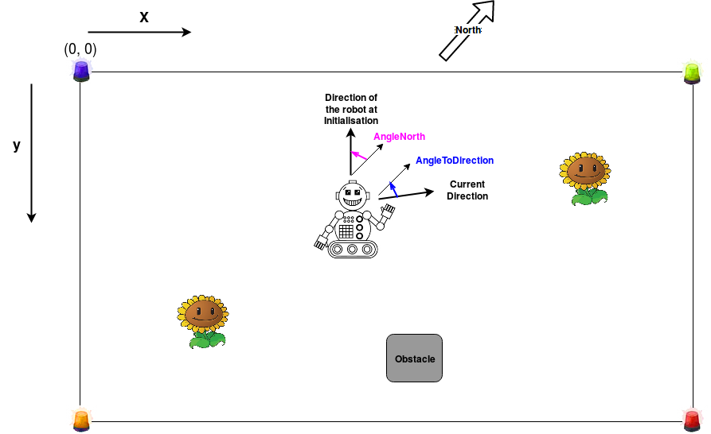

[](https://opensource.org/licenses/MIT)

## PleePlee Robot


PleePlee is a proof of concept of a mobile gardener robot.
This repository is about the location of the robot.
The location is based on a combination of a triangularisation from luminous
landmarks and odometry data.

## Features

The PleePlee robot is able to:
- :seedling: :shower: Water plants.
- :car: Move in a straight line and turn in place.
- :bulb: :satellite: Localize itself in a small area delimited by luminous landmarks.
- :curly_loop: Avoid obstacles.
- :eyes: Log any changes to the garden. (Foreign object or person crossing).

## Location

This repositiory only contains the code for the location of the robot.
The robot is able to move in a predefined area delimited at each corner
by luminous landmark.
Each luminous landmark is built from LEDs and each corner will have a different
color.

The location is estimated with multiple datas:
  - the distance to each luminous landmark
  - the angle between the axis of the robot and each landmark
  - the position of the north
  - odometry

The datas necessary for the location are to be measured with the necessary captors on the robot.

For the PleePlee robot here is how we took the necessary measures:
- Odometry with optical odometric captors.
- The north with a magnetic captor
- The angle between the axis and the robot and the LEDs: a camera rotating on a servomotor.



The angleNorth and angleToDirection datas are both the angle between the axis of the robot and the North.
The angleNort is only measured at the initialisation of the robot.
The angleToDirection is measured each time the location is needed.

## Installation and requirements

To test or use the code you only need python 3.

To install the package:

```bash
$ git clone https://github.com/pleeplee-robot/location.git
```

Install using develop mode:

```bash
$ python setup.py develop
```

## Getting started

The code is divided in four files:
- compute: contains most of the mathematical computations.
- geometry: contains the geometric shapes and utility mathematical functions.
- location: contains the main class of the api: Location. Also contains the Odometry class.
- utils: contains the class used for the data input.

If this is confusing, most of the time to use the api you will need these imports:

```python
from pleepleeloc.geometry import Point
from pleepleeloc.location import Location, Odometry
from pleepleeloc.utils import LED, Color, Data
```

Here is a code example of usage of the API:

Define the perimeter of the "garden":
```python
corner1 = LED(Color.RED, Point(3.0, 3.0))
corner2 = LED(Color.YELLOW, Point(13.0, 5.0))
corner3 = LED(Color.BLUE, Point(11.0, 9.0))
corner4 = LED(Color.GREEN, Point(1.0, 10.0))
perimeter = [corner1, corner2, corner3, corner4]
```

Get the datas at initialisation:
```python
#Direction of initialisation
dirInit = (-10.0, -10.0)
angleNorth = -45.0
angleToDirection = -90.0
# Height difference between the height of the robot camera and the height of the LEDS
height = 0.0
```

Initialize the datas of the LEDS and the angle between their position and the axis of the robot:
```python
args = [angleNorth, angleToDirection, perimeter]

data0 = Data(Color.RED, 134.0, *args)
data1 = Data(Color.YELLOW, 19.0, *args)
data2 = Data(Color.BLUE, -25.0, *args)
datas = [data0, data1, data2]
```
Initialise the Odometry datas:
```python
odometry = Odometry(Point(6.5, 6.7), 0.6)
```
Finally computation of the current position of the robot given all these datas:
```python
loc = Location(angleNorth, dirInit, height, *perimeter)
actualLocation = loc.computePos(angleToDirection, odometry, *datas)
```

The `Location` class only needs to be initialized once and the location can
be updated easily with the `Location.computePos` function.

## Documentation of the project

The documentation is generated with sphinx.

You can get the documentation of the project by installing the package as specified above and just running the `make doc` command.
Then use your favorite web navigator to open the `index.html` located in `docs/build/html`.

## Running the tests

To run the test:
- Get the pytest and pytest-mock packages.
- Run the ``make check`` command or ``pytest``
